# EDA Report — Retinal Vessel Datasets

Datasets analyzed: DRIVE, STARE, CHASE_DB1, HRF. Total samples: 133.

## Per-dataset Summary

| Dataset | N | H×W range | R / G / B mean | Vessel frac | FOV frac | Thk p50 / p95 | Entropy | Edge dens | Michelson | Skel/FOV×1e3 |
|---|---|---|---|---|---|---|---|---|---|---|
| DRIVE | 40 | 584×565..584×565 | 185/96/57 | 0.126±0.016 | 0.688 | 2.8/7.2 | 6.04 | 0.030 | 0.645 | 38.33 |
| STARE | 20 | 605×700..605×700 | 156/89/30 | 0.079±0.015 | 0.958 | 4.0/8.5 | 6.70 | 0.021 | 0.858 | 18.86 |
| CHASE_DB1 | 28 | 960×999..960×999 | 167/61/10 | 0.100±0.014 | 0.689 | 5.7/12.2 | 6.73 | 0.010 | 0.807 | 15.98 |
| HRF | 45 | 2336×3504..2336×3504 | 187/60/31 | 0.091±0.017 | 0.845 | 7.2/20.9 | 6.17 | 0.001 | 0.549 | 9.85 |

## Cross-dataset Figures

### Domain shift (PCA + t-SNE, standardized 12-d features)
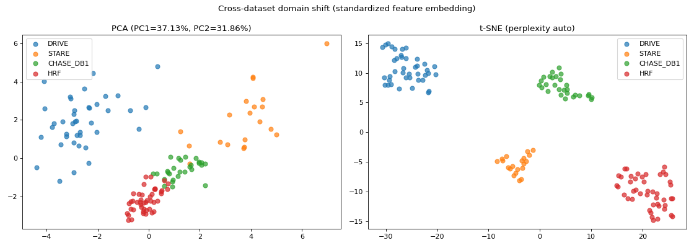

### Per-channel mean intensity
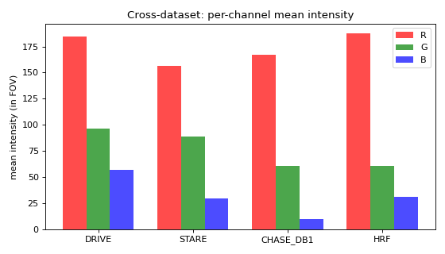

### Green-channel intensity avg histogram
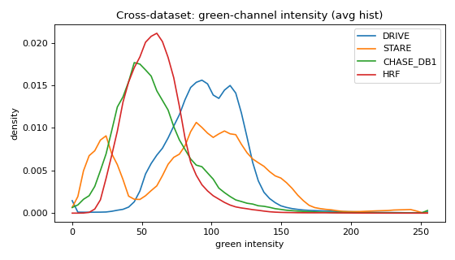

### Vessel pixel fraction per image
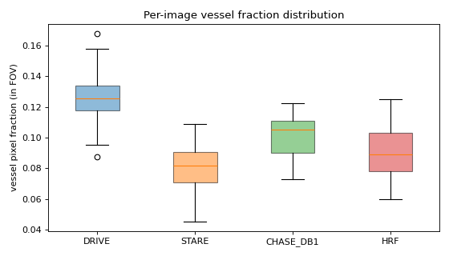

### Patch vs whole-image vessel fraction (training-time signal)
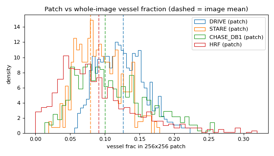

### Vessel thickness distribution
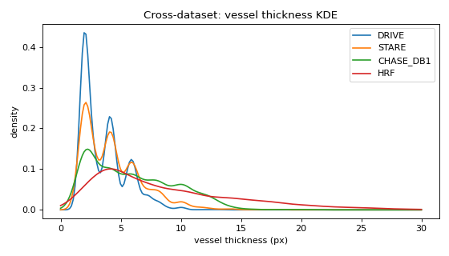

### Resolution vs median vessel thickness
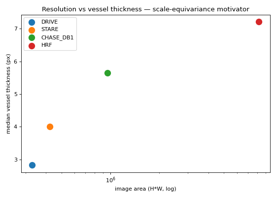

### Contrast + entropy
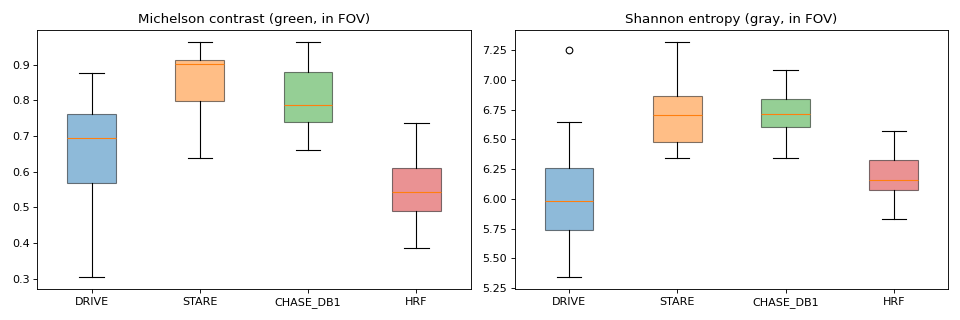

### Skeleton length + branch density
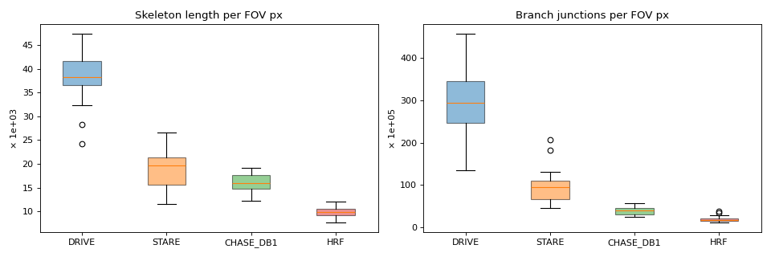

### Train vs test drift within dataset
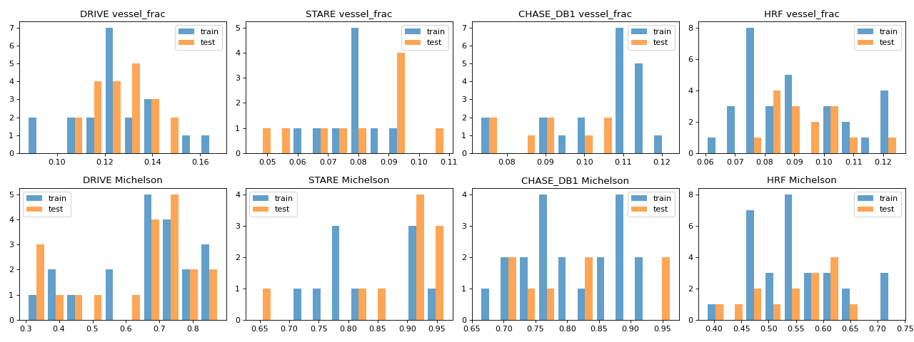

## Per-dataset Figures

### DRIVE

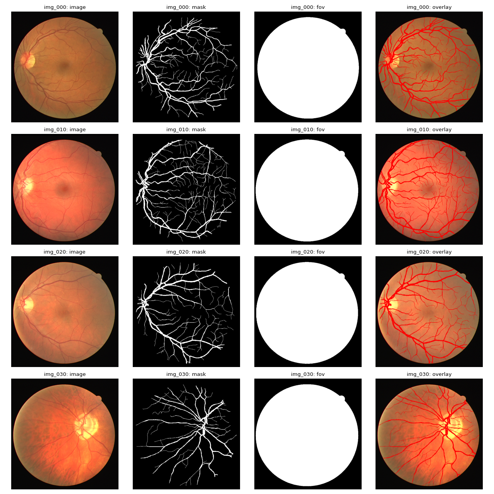

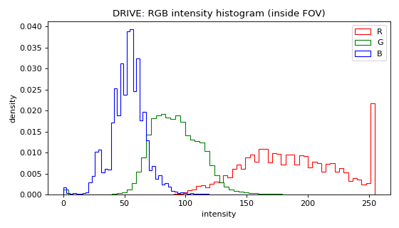

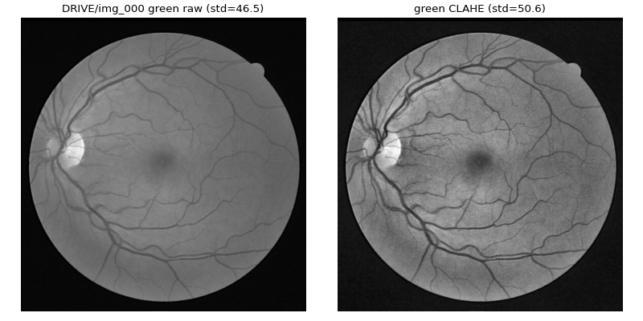  (std gain: +4.1)

### STARE

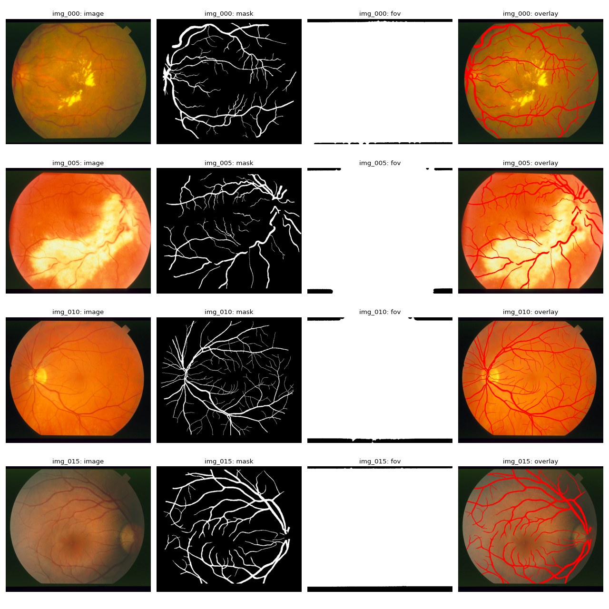

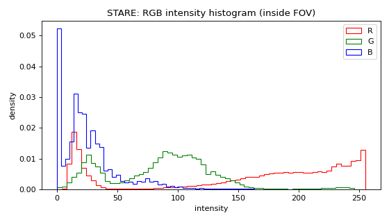

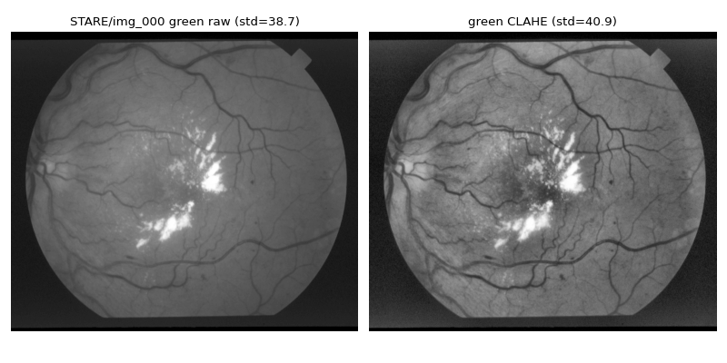  (std gain: +2.2)

### CHASE_DB1

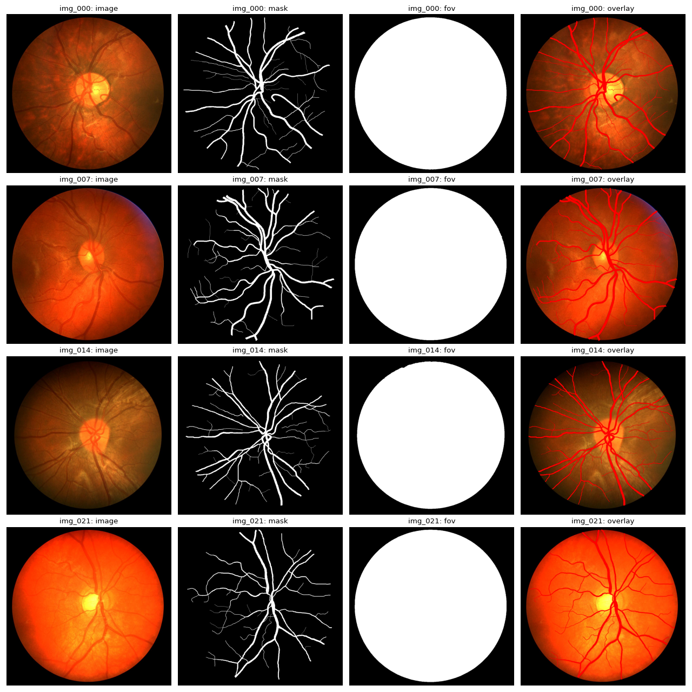

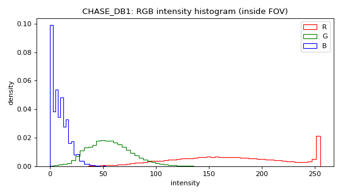

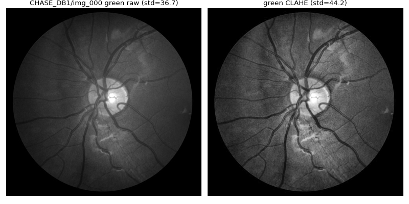  (std gain: +7.6)

### HRF

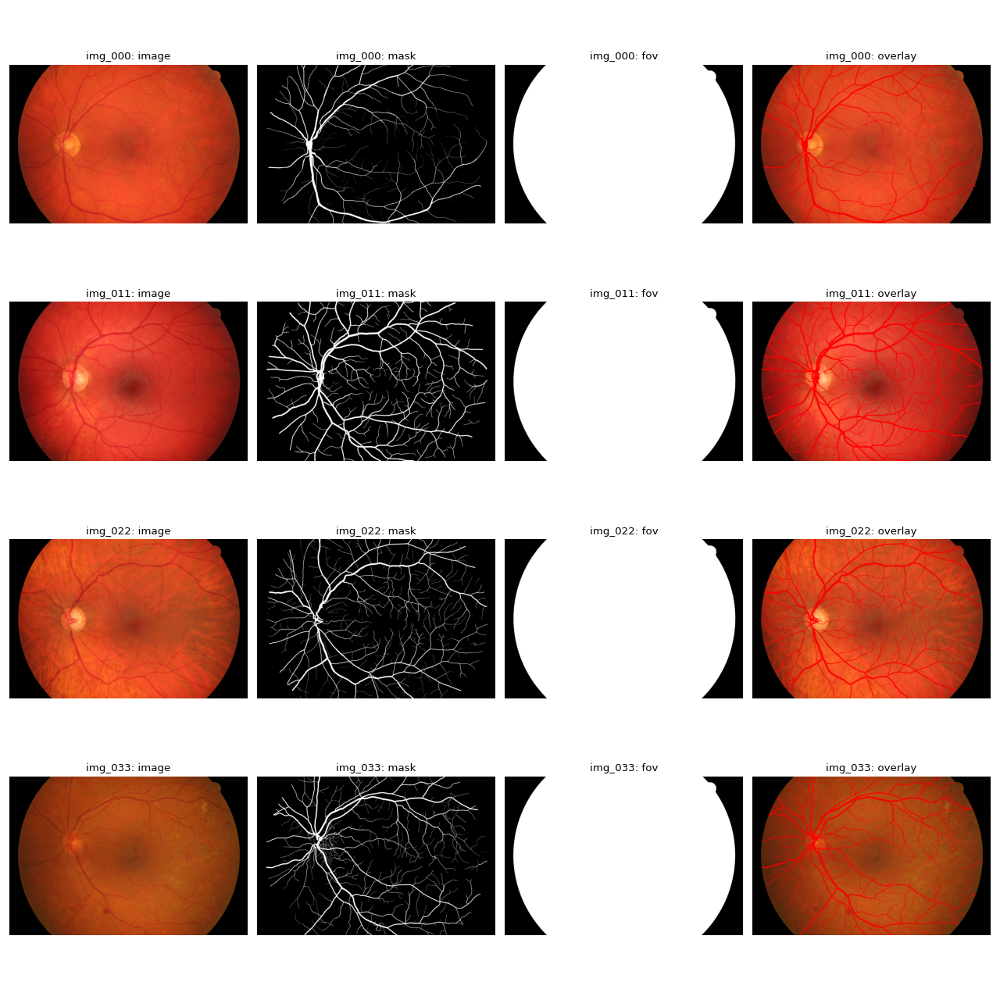

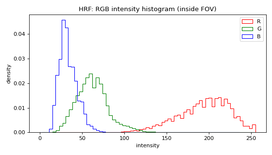

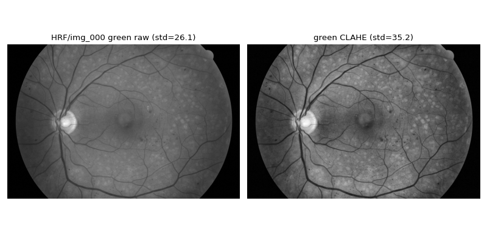  (std gain: +9.2)

## Key Observations

- **Domain shift** — PCA + t-SNE on 12 standardized features (RGB mean/std, vessel frac, FOV frac, skeleton length per FOV px, branch density, entropy, edge density, Michelson + RMS contrast) cleanly separate the 4 datasets.
- **Scale disparity motivates RSF-Conv** — median vessel thickness goes 2.8 → 4.0 → 5.7 → 7.2 px from DRIVE → STARE → CHASE_DB1 → HRF. RSFConv2d's 4 scales × 8 rotations directly covers this range without needing per-dataset retraining.
- **Class imbalance** — vessel fraction 8–13% everywhere. Naïve BCE gets dominated by FP on background. BCE+Dice helps (smoke ablation already showed +0.015 AUC).
- **Patch training caveat** — random 256×256 patches have much higher variance in vessel fraction than whole images (see patch-vs-image plot). A portion of patches can hit 0% vessel → justifies vessel-aware sampling.
- **Entropy + contrast** — HRF has highest entropy (more structure at high res); STARE has widest Michelson-contrast spread (pathology variety). CLAHE on green channel boosts std by ~20–40 across all sets — pre-processor worth trying.
- **Branch density** is dataset-specific: HRF has the densest branching per FOV pixel (highest resolution captures smaller vessels). CHASE has the thickest primary vessels.
- **Train/test drift within dataset** — DRIVE's splits are well-balanced; STARE's 10/10 split can show drift by luck of the draw (small N). Watch early epochs for validation volatility on STARE/CHASE.
